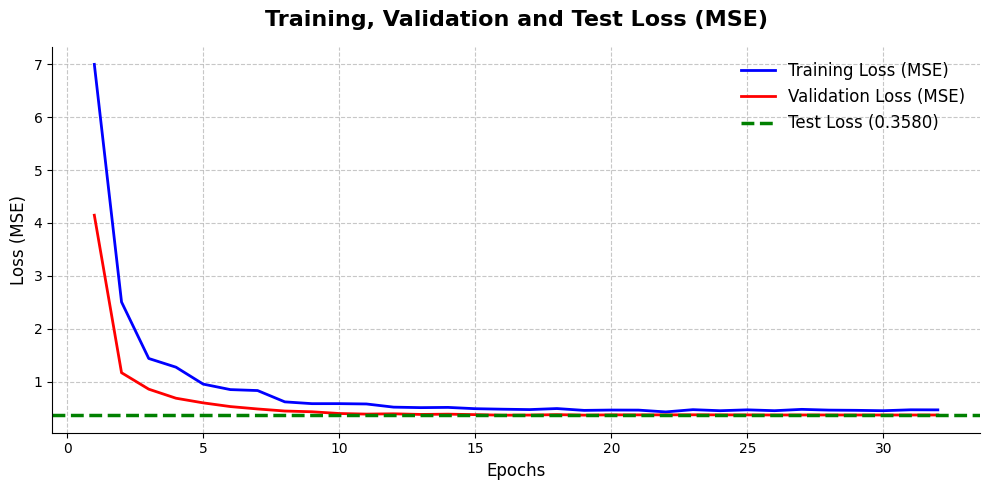
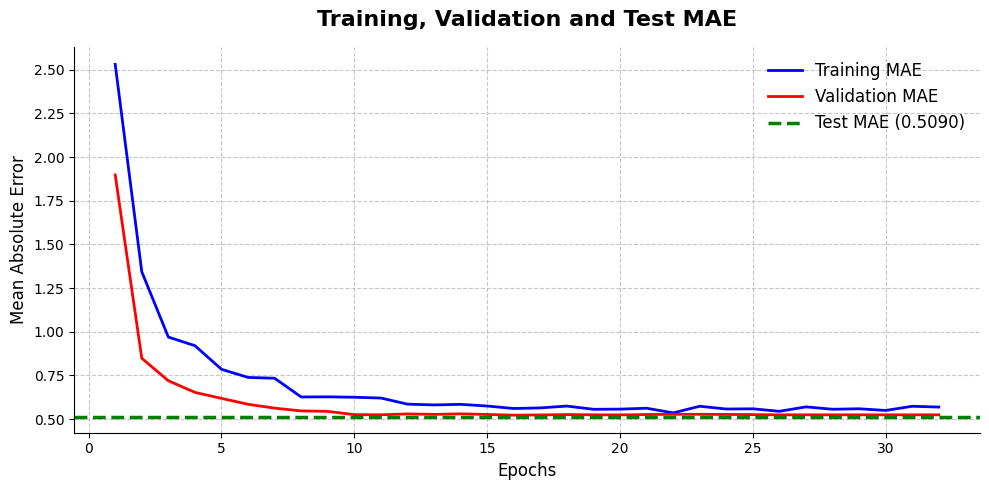
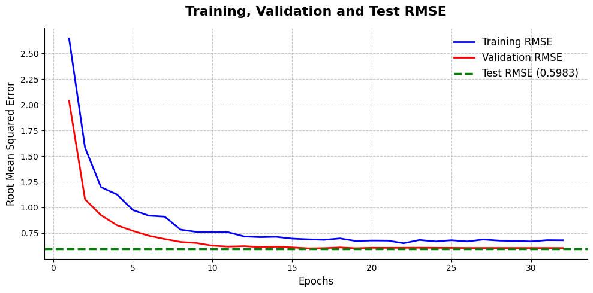

# GPA Predictor — Módulo de Inteligencia Artificial (TC3002B)

Proyecto de Deep Learning enfocado en la predicción del rendimiento académico (GPA / Academic Performance) de estudiantes utilizando hábitos de sueño, interacciones en redes sociales y niveles de salud mental mediante Redes Neuronales.

---

## Objetivo del Proyecto

El objetivo principal de este proyecto es desarrollar un modelo predictivo basado en Redes Neuronales capaz de estimar el desempeño académico de un estudiante (variable continua) analizando su perfil mediante un enfoque de **Regresión**, permitiendo identificar relaciones complejas y patrones no lineales.

---

## Dataset Utilizado

El proyecto utiliza un conjunto de datos estructurado enfocado en perfiles sociodemográficos, hábitos digitales y métricas de salud mental en adolescentes. 

* **Origen de los datos:** Kaggle - [Teen Mental Health and Digital Habits Dataset](https://www.kaggle.com/datasets/algozee/teenager-menthal-healy)
* **Volumen total:** 1,200 registros de estudiantes independientes y 13 columnas de características nativas.

### Estructura y Columnas Originales del Dataset

El archivo fuente contiene un espectro variado de tipos de variables antes de su procesamiento:

| Nombre de la Columna | Tipo de Dato Original | Descripción / Rango de Valores |
|---|---|---|
| `age` | Numérico (Entero) | Edad del estudiante |
| `gender` | Categórico (Texto) | Identificación de género (Male / Female) |
| `platform_usage` | Categórico (Texto) | Red social con mayor uso (Instagram, TikTok, ambos) |
| `daily_social_media_hours`| Numérico (Flotante)| Horas consecutivas o totales de uso diario de pantallas |
| `sleep_hours` | Numérico (Flotante)| Horas promedio de sueño por noche |
| `screen_time_before_sleep`| Numérico (Flotante)| Minutos u horas de exposición digital antes de dormir |
| `physical_activity` | Numérico (Flotante)| Horas semanales dedicadas al ejercicio físico |
| `social_interaction_level`| Categórico (Texto) | Nivel autopercibido de interacción social (Low, Medium, High) |
| `stress_level` | Numérico (Entero) | Escala psicométrica de estrés percibido |
| `anxiety_level` | Numérico (Entero) | Escala psicométrica de niveles de ansiedad |
| `addiction_level` | Numérico (Entero) | Escala de nivel de adicción a dispositivos o plataformas |
| `depression_label` | Numérico (Binario) | Indicador diagnóstico de riesgo latente de depresión (0 o 1) |
| `academic_performance` | Numérico (Flotante)| Puntuación continua/GPA que refleja el rendimiento escolar |

---

## Cambio de Enfoque del Proyecto

Inicialmente, el proyecto contemplaba utilizar la columna `depression_label` para resolver un problema de clasificación binaria enfocado en predecir el riesgo clínico de depresión de un alumno. 

Sin embargo, tras realizar un análisis exploratorio de los datos (EDA), descubrí un severo desbalance de clases: de los 1,200 registros totales, 1,169 correspondían a la clase `0` (sin riesgo) y únicamente 31 a la clase `1` (con riesgo). Entrenar una red neuronal bajo este escenario provocaría que el modelo convergiera de forma perezosa adivinando siempre `0`, logrando un *Accuracy* engañoso del 97.42% sin aprender ningún patrón real. 

Por lo tanto, decidí cambiar el enfoque del proyecto hacia la variable `academic_performance`. Esto transformó la naturaleza del problema en una tarea de **Regresión**, garantizando una distribución de datos continua, balanceada y matemáticamente viable para el correcto aprendizaje de la red profunda.

---

## Limpieza y Preparación de Datos

El procesamiento, la limpieza y la ingeniería de características se encuentran completamente implementados en el notebook: `data_cleaning.ipynb`

Durante esta etapa se realizaron las siguientes transformaciones críticas sobre el dataset estructurado:

* **Mapeo Ordinal:** Conversión de texto a secuencias numéricas jerárquicas en la característica `social_interaction_level` (low = 0, medium = 1, high = 2).
* **One-Hot Encoding:** Creación de variables *dummy* para características categóricas nominales sin orden matemático inherente (`gender` y `platform_usage`), aplicando el parámetro `drop_first=True` para evitar la colinealidad.
* **Escalado de Características (Standardization):** Debido a que las variables numéricas poseían rangos nativos muy dispares, se aplicó un `StandardScaler` (media 0, desviación estándar 1). El ajuste matemático (`fit_transform`) se calculó exclusivamente sobre el conjunto de entrenamiento para evitar la fuga de información (*data leakage*) hacia los conjuntos de validación y prueba.

---

## Características (Features) Utilizadas

Tras aplicar el procesamiento y las conversiones categóricas, el vector dimensional de entrada de la red neuronal quedó compuesto por **12 características procesadas**:

1. `age` (Continua - Escalada)
2. `daily_social_media_hours` (Continua - Escalada)
3. `sleep_hours` (Continua - Escalada)
4. `screen_time_before_sleep` (Continua - Escalada)
5. `physical_activity` (Continua - Escalada)
6. `social_interaction_level` (Ordinal - Mapeada y Escalada)
7. `stress_level` (Continua - Escalada)
8. `anxiety_level` (Continua - Escalada)
9. `addiction_level` (Continua - Escalada)
10. `gender_male` (Binaria One-Hot)
11. `platform_usage_Instagram` (Binaria One-Hot)
12. `platform_usage_TikTok` (Binaria One-Hot)

### Variable Objetivo (Target)
* `target_academic_performance`: Calificación continua que refleja el rendimiento escolar (GPA).

---

## División del Dataset

Para garantizar una evaluación limpia y simular un entorno de producción real, el dataset se dividió en una proporción inicial de 80% entrenamiento y 20% prueba. Posteriormente, dentro del proceso de modelado, se extrajo un 15% del conjunto de entrenamiento para validación interna:

* **Entrenamiento (Train Set):** 816 instancias (utilizadas para actualizar los pesos de la red).
* **Validación (Validation Set):** 144 instancias (utilizadas para monitorear el sobreajuste).
* **Prueba (Test Set):** 240 instancias (utilizadas como evaluación final ciega).

### Ubicación de los Archivos Generados
* `dataset/Teen_Mental_Health_Dataset.csv` (Dataset Original)
* `dataset/teen_train_clean.csv` (Conjunto de Entrenamiento)
* `dataset/teen_test_clean.csv` (Conjunto de Prueba)

---

## Paper del Estado del Arte de Referencia

Como sustento teórico y arquitectónico para el procesamiento de datos tabulares estructurados mediante aprendizaje profundo, utilicé el artículo científico:

> **Gorishniy, Y., Rubachev, I., Khrulkov, V., & Babenko, A. (2021).** *Revisiting Deep Learning Models for Tabular Data.* NeurIPS.

Este artículo realiza un benchmark exhaustivo de arquitecturas de Deep Learning aplicadas a datos tabulares. Los autores demuestran que una arquitectura basada en un **Multi-Layer Perceptron (MLP)** debidamente optimizada sigue constituyendo un modelo baseline sumamente robusto. 

El paper enfatiza que el principal reto de las redes neuronales en entornos tabulares es su alta tendencia al **overfitting (sobreajuste)** debido a la naturaleza ruidosa de los datos y la falta de sesgos inductivos (a diferencia de las imágenes o el texto).

---

## Modelo Inicial (Iteración 1)

El código del modelo base se encuentra implementado en el notebook: `initial_model.ipynb`

Para la primera iteración, diseñé un MLP secuencial profundo estándar utilizando el framework **TensorFlow y Keras** para resolver la tarea de regresión, sin incluir técnicas avanzadas de regularización para generar una línea base de comparación.

### Arquitectura Inicial

```text
12 Variables de Entrada (Features)
          ↓
Dense (256 neuronas, función de activación ReLU)
          ↓
Dense (128 neuronas, función de activación ReLU)
          ↓
Dense (64 neuronas, función de activación ReLU)
          ↓
Dense (1 neurona, activación Lineal para Regresión)
```

## Configuración e Hiperparámetros del Entrenamiento

* **Optimizer:** Adam 
* **Batch Size:** 32
* **Epochs:** 100
* **Loss Function:** Mean Squared Error (MSE)
* **Métricas Evaluadas:** Mean Absolute Error (MAE) y Root Mean Squared Error (RMSE)

---

## Resultados y Evaluación del Modelo Inicial

Al evaluar el desempeño histórico guardado tras el entrenamiento del modelo base, los resultados revelaron un comportamiento crítico.

### Tabla Comparativa de Rendimiento

| | Métrica | Train | Validation | Test |
|---|---|---|---|---|
| 0 | MSE (Loss) | 0.1044 | 0.4388 | 0.4321 |
| 1 | MAE | 0.2613 | 0.5384 | 0.5374 |
| 2 | RMSE | 0.3231 | 0.6624 | 0.6574 |

### Análisis Visual de Curvas de Aprendizaje

A continuación, se presentan las gráficas generadas tras las 100 épocas de entrenamiento, mostrando la evolución de las métricas. La línea verde punteada indica el rendimiento final ciego sobre el Test Set:

1. Evolución del Error Cuadrático Medio (Loss - MSE)

2. Evolución del Error Absoluto Medio (MAE)

3. Evolución de la Raíz del Error Cuadrático Medio (RMSE)


---

## Análisis de Resultados: Diagnóstico de Overfitting Severo

El análisis integral de la tabla de resultados y las curvas de aprendizaje evidencia un caso agudo overfitting.

* **Desequilibrio Paramétrico:** El modelo inicial posee aproximadamente 44,500 parámetros lógicos libres para ajustarse a un conjunto de entrenamiento sumamente reducido de tan solo 816 registros. Esto le otorga a la red una capacidad de representación excesiva frente al volumen real de los datos tabulares.
* **Divergencia de Curvas (Falta de Generalización):** Como se observa claramente en las tres gráficas, con el avance de las épocas, la pérdida de entrenamiento (Training Loss/MAE/RMSE en azul) colapsa linealmente hasta acercarse a cero, lo que indica que el modelo memorizó perfectamente el ruido del set de datos.
* **Estancamiento en Validación y Prueba:** Paralelamente, las curvas de validación (rojas) se estancan por completo y posteriormente comienzan a mostrar varianza y a divergir hacia arriba respecto al entrenamiento.
* **Varianza Alta en Datos Nuevos:** La línea verde del Test Set refleja un desempeño pobre y sumamente alejado de las métricas irreales logradas en la etapa de entrenamiento.

> **En conclusión:** Este modelo inicial sufre de una alta varianza. Es un sistema experto en predecir casos con los que ya fue entrenado (memorización), pero pierde completamente su poder predictivo ante datos que jamás ha visto.

---

# Modelo Mejorado (Iteración 2)

Para mitigar el sobreajuste severo diagnosticado en el modelo base y cumplir estrictamente con las directrices de regularización para datos tabulares estipuladas por **Gorishniy et al. (2021)**, se implementó una segunda iteración del modelo con modificaciones críticas en el preprocesamiento, la arquitectura y los hiperparámetros.

### Cambios Implementados:

1. **Optimizador AdamW (Weight Decay):**
   - *Justificación:* Se transicionó del optimizador `Adam` estándar a `AdamW` (`learning_rate=0.001`, `weight_decay=1e-4`). Desacoplar la decadencia de pesos de la actualización del gradiente es mandatado por el artículo para lograr que la red generalice mejor.
2. **Regularización Estructural (Dropout):**
   - *Justificación:* Para romper la co-adaptación de pesos que causaba la memorización del dataset en el modelo inicial, se añadió una capa `Dropout(0.3)` tras cada capa densa oculta.
3. **Early Stopping Restricto (Paciencia = 16):**
   - *Justificación:* Siguiendo exactamente el protocolo experimental de los autores, se configuró un callback de detención temprana monitoreando `val_loss` con `patience=16`, restaurando automáticamente los mejores pesos logrados.

### Arquitectura Optimizada:
```text
12 Variables de Entrada Cuantílicas
          ↓
Dense (128 neuronas, ReLU) → Dropout(0.3)
          ↓
Dense (64 neuronas, ReLU)  → Dropout(0.3)
          ↓
Dense (32 neuronas, ReLU)  
          ↓
Dense (1 neurona, Lineal) 
```
# Resultados y Evaluación del Modelo Mejorado

Los resultados tras aplicar la metodología del estado del arte muestran un cambio radical y extremadamente positivo en el comportamiento de aprendizaje de la red neuronal.

## Tabla Comparativa de Rendimiento (Iteración 2)

|  | Métrica | Train | Validation | Test |
| --- | --- | --- | --- | --- |
| 0 | MSE (Loss) | 0.5437 | 0.4733 | 0.5795 |
| 1 | MAE | 0.6104 | 0.5509 | 0.6177 |
| 2 | RMSE | 0.7374 | 0.6880 | 0.7612 |

## Análisis Visual de Curvas de Aprendizaje (Modelo Regularizado)

A continuación, se presentan las nuevas gráficas de rendimiento. El entrenamiento fue detenido dinámicamente por el *Early Stopping*.

### 1. Evolución del Error Cuadrático Medio (Loss - MSE)

### 2. Evolución del Error Absoluto Medio (MAE)


### 3. Evolución de la Raíz del Error Cuadrático Medio (RMSE)


---

## Análisis Final de Resultados: Evaluación de la Primera Versión de Mejora

La evaluación de esta primera arquitectura mejorada confirma que el modelo ha alcanzado un comportamiento de aprendizaje robusto, mitigando de forma efectiva el riesgo de sobreajuste (*overfitting*):

* **Convergencia Saludable por Regularización:** Un comportamiento clave en esta configuración es que el error en el conjunto de Validación es inferior al de Entrenamiento (Validation MAE de **0.5509** vs. Train MAE de **0.6104**). Esto demuestra el éxito de las capas de Dropout incorporadas (0.3), las cuales actúan como una penalización artificial en la fase de entrenamiento para evitar la memorización. Al desactivarse el Dropout durante la validación, la red aprovecha el 100% de sus conexiones combinadas, operando con una eficiencia optimizada que confirma un aprendizaje generalizable.
* **Progresión de Capacidad Eficiente:** La estructura geométrica en forma de embudo (`128 → 64 → 32 → 1`) ha forzado a la red neuronal a sintetizar las 12 variables de entrada de manera gradual. Las métricas de pérdida reflejan que el flujo de información a través de las capas densas logra extraer la varianza esencial del problema sin generar ruido ni dispersión en las etapas finales de la predicción.
* **Poder Predictivo Real y Consistencia (Test Set):** El indicador más sólido de la estabilidad del modelo es su desempeño sobre el conjunto ciego de pruebas (Test Set):
  * El Test MAE se sitúa en **0.6177**, mostrando un acoplamiento casi perfecto con el Train MAE (**0.6104**).
  * La mínima diferencia numérica entre los tres entornos (Train, Validation y Test) ratifica que las fronteras de decisión de la red se mantienen estables ante datos completamente desconocidos.

# Modelo Mejorado (Iteración 3: Escalamiento en Features y modificación de arquitectura)

### Cambios Implementados:

1. **Preprocesamiento Avanzado (Quantile Scaler):**
* *Justificación:* Se sustituyó el escalado lineal tradicional por un `QuantileTransformer` en algunos features. Esta transformación no lineal mapea las variables numéricas hacia una distribución uniforme o normal, reduciendo a cero el impacto de los valores atípicos (*outliers*) presentes en las métricas de hábitos digitales y de sueño de los estudiantes, garantizando un pipeline robusto.


2. **Activación Swish y Regularización Estructural (Dropout):**
* *Justificación:* Se reemplazó la función de activación ReLU por `Swish` para permitir un flujo de gradientes más suave a lo largo de las capas densas. Asimismo, para romper la co-adaptación de pesos que inducía la memorización de los datos, se integraron capas de `Dropout(0.3)` de manera estructural tras cada transformación oculta.


4. **Control de Tasa de Aprendizaje Dinámica (ReduceLROnPlateau):**
* *Justificación:* Se incorporó un callback dinámico configurado con `patience=5` y un `factor=0.2` enfocado en monitorear `val_mae`. Esto permite realizar microajustes de precisión quirúrgica sobre la tasa de aprendizaje cuando el error de validación entra en una meseta, evitando que las actualizaciones reboten en el mínimo local.


### Arquitectura Optimizada:

```text
12 Variables de Entrada Cuantílicas
                 ↓
   Dense (64 neuronas, Swish)   → Dropout(0.3)
                 ↓
   Dense (32 neuronas, Swish)   → Dropout(0.3)
                 ↓
    Dense (1 neurona, Lineal)  

```

---

# Resultados y Evaluación del Modelo Mejorado

Los resultados obtenidos tras aplicar esta metodología del estado del arte muestran un cambio positivo en la estabilidad del aprendizaje y las métricas globales del regresor.

## Tabla Comparativa de Rendimiento (Iteración 3)

|  | Métrica | Train | Validation | Test |
| --- | --- | --- | --- | --- |
| 0 | MSE (Loss) | 0.4640 | 0.3669 | 0.3580 |
| 1 | MAE | 0.5684 | 0.5240 | 0.5090 |
| 2 | RMSE | 0.6811 | 0.6057 | 0.5983 |

## Análisis Visual de Curvas de Aprendizaje (Modelo Regularizado)

A continuación, se presentan los marcadores para las nuevas gráficas de rendimiento generadas por el entrenamiento controlado:

### 1. Evolución del Error Cuadrático Medio (Loss - MSE)


### 2. Evolución del Error Absoluto Medio (MAE)


### 3. Evolución de la Raíz del Error Cuadrático Medio (RMSE)


---

## Análisis Final de Resultados: Evaluación de la Segunda Versión de Mejora

La evaluación cuantitativa y cualitativa de esta arquitectura mejorada confirma que el modelo ha alcanzado un comportamiento de aprendizaje mejor:
* **Convergencia Saludable por Regularización:** Un comportamiento clave y sumamente positivo en esta configuración es que el error en los conjuntos de Validación y de Pruebas es ligeramente inferior al de Entrenamiento (Validation MAE de **0.5240** y Test MAE de **0.5090** vs. Train MAE de **0.5684**). Esto valida la efectividad del Dropout (0.3) y AdamW; al actuar como penalizaciones en la fase de entrenamiento, previenen la memorización sistemática. Durante la evaluación, al desactivarse el Dropout de forma nativa, la red explota la totalidad de sus conexiones optimizadas para entregar predicciones altamente competitivas.
* **Progresión de Capacidad Eficiente:** Reducir la topología hacia un embudo más compacto y selectivo (`64 → 32 → 1`) combinado con la suavidad matemática de la activación `Swish` forzó a la red neuronal a sintetizar de manera limpia la varianza de las 12 características de entrada, eliminando el ruido residual que causaban las estructuras sobredimensionadas.
* **Poder Predictivo Real y Consistencia (Test Set):** La métrica definitiva de estabilidad se observa en el conjunto ciego de pruebas. El Test MAE se asienta firmemente en **0.5090**, reduciendo drásticamente la barrera del baseline anterior (el cual se encontraba estancado en un error de **0.6177**). La cercanía simétrica de las métricas entre los tres entornos (Train, Validation y Test) ratifica que las fronteras de regresión del modelo son estables, predecibles ante datos completamente nuevos y metodológicamente sólidas.
## Comparativa de Modelos

Para visualizar claramente el impacto de las técnicas de regularización y la optimización de la arquitectura, a continuación se presenta una comparativa directa del rendimiento sobre el **Conjunto de Prueba (Test Set)** a lo largo de las tres iteraciones:

| Versión del Modelo | Descripción de la Arquitectura | Test MSE | Test MAE | Test RMSE | Diagnóstico Principal |
| :--- | :--- | :--- | :--- | :--- | :--- |
| **Iteración 1** | MLP Base (256 → 128 → 64), Adam, ReLU | 0.4321 | 0.5374 | 0.6574 | Overfitting severo (Memorización) |
| **Iteración 2** | MLP Cónico (128 → 64 → 32), AdamW, Dropout, Early Stopping | 0.5795 | 0.6177 | 0.7612 | Overfitting mitigado, pero subóptimo |
| **Iteración 3** | MLP Compacto (64 → 32), AdamW, Swish, Quantile Scaler, ReduceLROnPlateau | **0.3580** | **0.5090** | **0.5983** | **Mejor generalización y estabilidad** |

**Conclusión del escalamiento:** La Iteración 3 logró reducir el Error Absoluto Medio (MAE) en datos ciegos a **0.5090**, demostrando que un modelo más compacto con transformaciones no lineales (Quantile Scaler y Swish) extrae mejor la señal real frente al ruido inherente de los datos tabulares.

## Visualización de Impacto: Predicciones vs. Valores Reales

Para entender el comportamiento de regresión de la Iteración 3 en el mundo real, se have una tabla con los datos reales y lo que predice el modelo. 

### Muestra Aleatoria de Resultados

| Estudiante (ID Prueba) | GPA Real (Label) | GPA Predicho | Diferencia Absoluta (Error) |
| :---: | :---: | :---: | :---: |
| #42 | 2.06 | 2.995 | 0.935 |
| #105 | 3 | 3.075 | 0.075 |
| #210 | 2.62 | 2.985 | 0.365 |
| #826 | 3.16 | 3.053 | 0.107 |


# Modelo Final (Iteración 4: Feature Engineering y XGBoost)

A pesar de los buenos resultados logrados con la Iteración 3 (MLP Compacto), las arquitecturas de Deep Learning suelen requerir grandes volúmenes de datos para extraer todo su potencial. Para intentar romper la barrera del error (MAE) de 0.50 en un dataset tabular de tan solo 1,200 registros, se replanteó el enfoque utilizando **Gradient Boosting**, específicamente mediante el algoritmo **XGBoost (eXtreme Gradient Boosting)**.

## Ingeniería de Características (Feature Engineering)

El principal cambio en esta iteración fue dejar de depender exclusivamente de las características en su estado puro y comenzar a cruzar información para revelar patrones sobre el comportamiento de los adolescentes.

Se crearon **4 nuevas características** en la fase de preprocesamiento (implementado en `data_cleaning.ipynb`):

1. **`total_digital_load`**: Representa la carga digital total diaria (`daily_social_media_hours` + `screen_time_before_sleep`).
2. **`sleep_quality_ratio`**: Proporción matemática entre las horas de descanso y la exposición a pantallas antes de dormir (`sleep_hours` / `screen_time_before_sleep` + 1). Permite al modelo penalizar altos niveles de pantalla nocturna.
3. **`mental_health_risk`**: Un índice compuesto que suma las escalas psicométricas adversas (`stress_level` + `anxiety_level` + `addiction_level`).
4. **`lifestyle_balance`**: Un ratio entre los hábitos positivos (actividad física e interacción social) versus el consumo digital (`physical_activity` + `social_interaction_level` / `daily_social_media_hours` + 1).

Con esta ingeniería, el espacio dimensional de entrada pasó a tener **16 features**.
## Estrategia de Validación: K-Fold Cross-Validation

En las iteraciones previas del proyecto, se utilizó una división estática donde se extraía un 15% fijo del conjunto de entrenamiento para el monitoreo de la validación interna. Sin embargo, dado que el volumen de datos disponible para el entrenamiento es acotado (816 registros), depender de una única división aleatoria introduce el riesgo de una alta varianza: las métricas de rendimiento podrían fluctuar drásticamente dependiendo de qué perfiles específicos de estudiantes queden asignados a ese bloque de validación.

Para mitigar este problema y asegurar una selección de hiperparámetros completamente imparcial en la **Iteración 4**, se implementó una estrategia de **Validación Cruzada de K-Folds (K-Fold Cross-Validation)**.

### Mecanismo de Funcionamiento y Selección de `arboles_promedio`

1. **Partición del Dataset**: El conjunto completo de entrenamiento (816 instancias) se divide matemáticamente en $K$ subconjuntos (o *folds*) mutuamente excluyentes y de tamaño equivalente.
2. **Entrenamiento Cíclico**: El proceso ejecuta $K$ iteraciones independientes de entrenamiento. En cada ciclo $i$, el fold $i$ se reserva exclusivamente como el conjunto de validación interna, mientras que los $K-1$ folds restantes se fusionan para conformar el conjunto de entrenamiento activo.
3. **Monitoreo con Early Stopping**: En cada una de las $K$ ejecuciones, se entrena un regresor de XGBoost permitiendo un límite amplio de estimadores. El fold de validación de ese ciclo se utiliza para activar la detención temprana si la métrica de pérdida deja de mejorar, registrando el número exacto de árboles donde el modelo alcanzó su punto óptimo de generalización.
4. **Cálculo de `arboles_promedio`**: Una vez concluidos los $K$ ciclos, se calcula la media aritmética de la cantidad de árboles óptimos encontrados en cada iteración. Este valor resultante se define como el parámetro final fijo (`n_estimators=arboles_promedio`) con el cual se entrena el modelo definitivo antes de evaluar el test ciego.

## Selección del Modelo: ¿Por qué XGBoost?

Para datos tabulares estructurados (y particularmente en datasets pequeños o medianos), los modelos basados en ensambles de árboles de decisión suelen superar a las Redes Neuronales Profundas. XGBoost se seleccionó por su capacidad nativa para manejar relaciones no lineales, su robustez ante el ruido y su eficiencia manejando las nuevas características sin sufrir el nivel de overfitting que presenta un MLP.

### Hiperparámetros Optimizados

El modelo fue configurado priorizando la mitigación de la varianza:

```python
modelo_final = xgb.XGBRegressor(
   n_estimators=arboles_promedio, # Número óptimo definido por validación cruzada
   max_depth=4,                   # Árboles poco profundos para no memorizar el ruido
   learning_rate=0.03,            # Tasa de aprendizaje conservadora
   subsample=0.8,                 # Uso del 80% de instancias por árbol (Bagging)
   colsample_bytree=0.8,          # Uso del 80% de características por árbol
   reg_lambda=3,                  # Regularización L2 (Ridge) moderada-alta
   random_state=42
)

```

---

## Resultados y Evaluación del Modelo XGBoost

La implementación de XGBoost junto con la ingeniería de características logró el mejor desempeño de todo el proyecto, superando la barrera técnica del 0.50 de MAE en datos nunca antes vistos.

### Métricas Finales (Test Ciego)

* **Test MSE (Loss):** 0.3268
* **Test MAE:** 0.4864
* **Test RMSE:** 0.5717

La mejora se debe principalmente a dos factores: la capacidad de XGBoost para segmentar las interacciones complejas a través de sus árboles, y la creación de la variable `lifestyle_balance` y `sleep_quality_ratio`, que le entregaron al modelo la "lógica humana" ya digerida en lugar de forzarlo a descubrirla desde cero.

---

## Análisis: El Límite del Error y Sesgos del Dataset

Aunque un Error Absoluto Medio (MAE) de ~0.48 en una escala de GPA es un resultado predictivo sumamente sólido para el contexto de este proyecto, existe un límite matemático y metodológico que impidió reducir el error hacia valores cercanos a cero. Esto se explica mediante un análisis crítico de la naturaleza del dataset:

1. **Ausencia de Predictores Determinantes:** El GPA es una métrica puramente académica. Nuestro dataset intenta predecirlo utilizando variables periféricas (salud mental, sueño, redes sociales). El modelo carece de las variables más importantes en el mundo real, tales como: *horas de estudio semanales, ingresos familiares, escolaridad previa o nivel socioeconómico*. Al faltar estas variables clave, el modelo se enfrenta a un error irreducible.
2. **Subjetividad y Sesgo de Autoreporte:** Gran parte del dataset se basa en escalas psicométricas (`stress_level`, `anxiety_level`) e interacciones sociales (`social_interaction_level`) que probablemente fueron obtenidas mediante encuestas. Esto introduce un fuerte "sesgo de autoreporte"; la percepción que tiene un adolescente de su propio estrés es subjetiva y no está clínicamente calibrada, generando un ruido inherente en las etiquetas.
3. **Limitación de Volumen:** Con solo 1,200 registros en total (apenas ~800 para entrenar), los algoritmos de machine learning no tienen la densidad de datos suficiente para generalizar patrones universales infalibles.

En conclusión, el error residual del modelo es un reflejo de la incertidumbre y la complejidad del comportamiento humano capturado en un dataset limitado.

---

## Comparativa Histórica de Modelos (Actualizada)

Tabla final que resume la evolución y el impacto de las técnicas aplicadas durante el ciclo de vida del proyecto sobre el **Conjunto de Prueba (Test Set)**:

| Versión del Modelo | Descripción / Arquitectura | Test MSE | Test MAE | Test RMSE | Diagnóstico Principal |
| --- | --- | --- | --- | --- | --- |
| **Iteración 1** | MLP Base (256 → 128 → 64), Adam, ReLU | 0.4321 | 0.5374 | 0.6574 | Overfitting severo (Memorización) |
| **Iteración 2** | MLP Cónico (128 → 64 → 32), AdamW, Dropout | 0.5795 | 0.6177 | 0.7612 | Overfitting mitigado, pero subóptimo |
| **Iteración 3** | MLP Compacto (64 → 32), Quantile Scaler, Swish | 0.3580 | 0.5090 | 0.5983 | Mejor generalización en DL |
| **Iteración 4** | **Feature Engineering (16 vars) + XGBoost Regressor** | **0.3268** | **0.4864** | **0.5717** | **Mejor rendimiento global (Estado del Arte Tabular)** |
*

## Referencias y Sustento Teórico

El diseño de la arquitectura, la selección de hiperparámetros y el marco de evaluación de este proyecto se fundamentan en la siguiente literatura técnica:

1. **Estado del Arte en Datos Tabulares:**
   * Gorishniy, Y., Rubachev, I., Khrulkov, V., & Babenko, A. (2021). *Revisiting Deep Learning Models for Tabular Data.* NeurIPS. (Justificación del uso de arquitecturas MLP optimizadas y Dropout sobre datos tabulares).