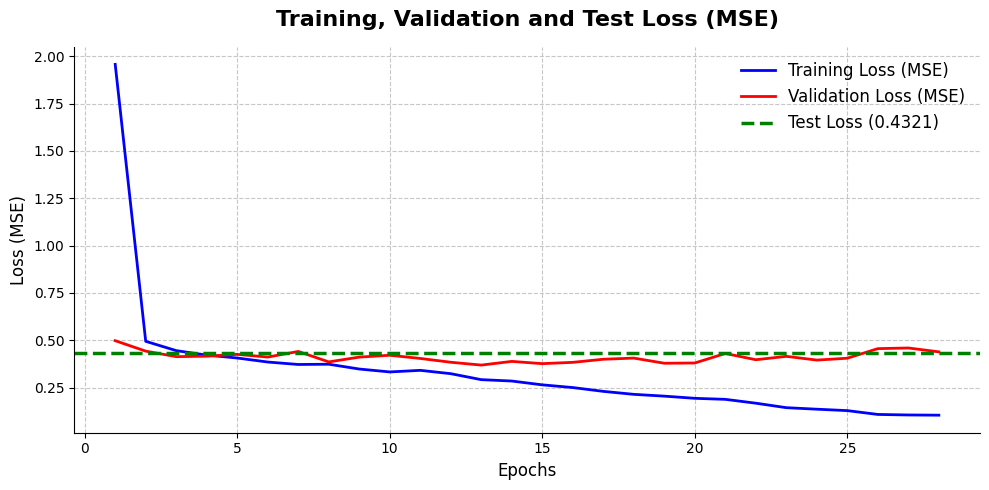
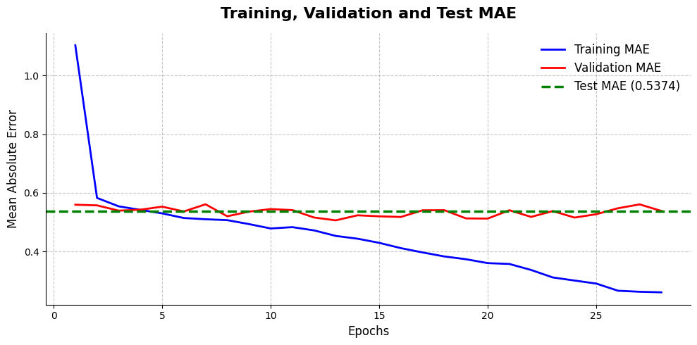
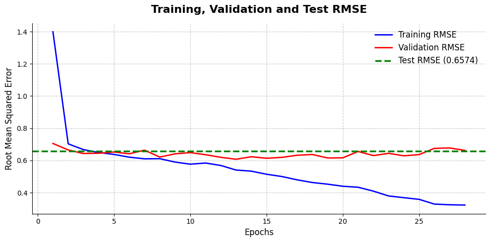
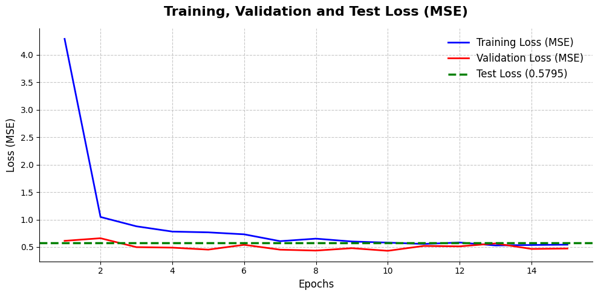
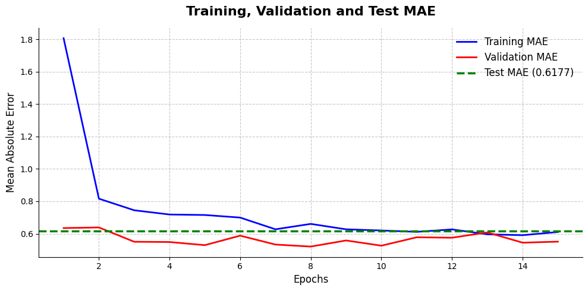
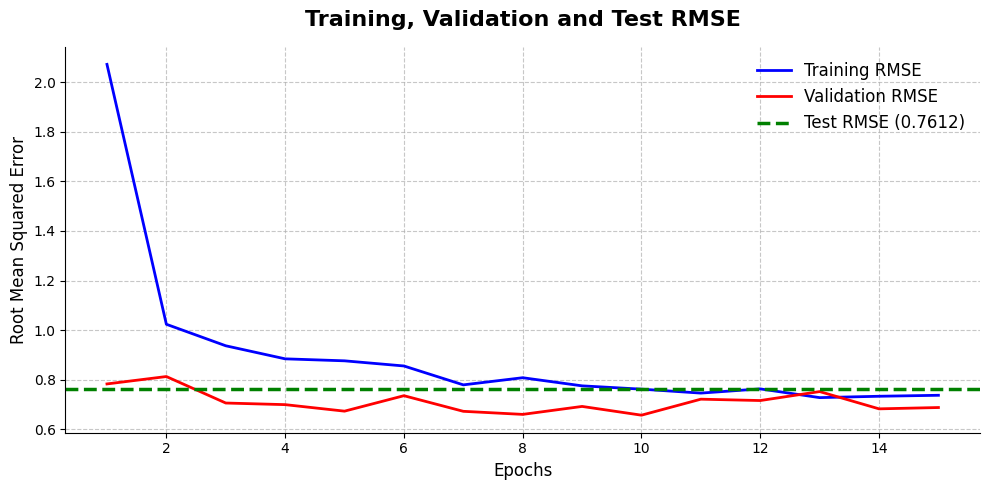

# GPA Predictor — Módulo de Inteligencia Artificial (TC3002B)

Proyecto de Deep Learning enfocado en la predicción del rendimiento académico (GPA / Academic Performance) de estudiantes utilizando hábitos de sueño, interacciones en redes sociales y niveles de salud mental mediante Redes Neuronales.

---

## Objetivo del Proyecto

El objetivo principal de este proyecto es desarrollar un modelo predictivo basado en Redes Neuronales capaz de estimar el desempeño académico de un estudiante (variable continua) analizando su perfil mediante un enfoque de **Regresión**, permitiendo identificar relaciones complejas y patrones no lineales.

---

## Dataset Utilizado

El proyecto utiliza un conjunto de datos estructurado enfocado en perfiles sociodemográficos, hábitos digitales y métricas de salud mental en adolescentes. 

* **Origen de los datos:** Kaggle - [Teen Mental Health and Digital Habits Dataset](https://www.kaggle.com/datasets/algozee/teenager-menthal-healy)
* **Volumen total:** 1,200 registros de estudiantes independientes y 13 columnas de características nativas.

### Estructura y Columnas Originales del Dataset

El archivo fuente contiene un espectro variado de tipos de variables antes de su procesamiento:

| Nombre de la Columna | Tipo de Dato Original | Descripción / Rango de Valores |
|---|---|---|
| `age` | Numérico (Entero) | Edad del estudiante |
| `gender` | Categórico (Texto) | Identificación de género (Male / Female) |
| `platform_usage` | Categórico (Texto) | Red social con mayor uso (Instagram, TikTok, ambos) |
| `daily_social_media_hours`| Numérico (Flotante)| Horas consecutivas o totales de uso diario de pantallas |
| `sleep_hours` | Numérico (Flotante)| Horas promedio de sueño por noche |
| `screen_time_before_sleep`| Numérico (Flotante)| Minutos u horas de exposición digital antes de dormir |
| `physical_activity` | Numérico (Flotante)| Horas semanales dedicadas al ejercicio físico |
| `social_interaction_level`| Categórico (Texto) | Nivel autopercibido de interacción social (Low, Medium, High) |
| `stress_level` | Numérico (Entero) | Escala psicométrica de estrés percibido |
| `anxiety_level` | Numérico (Entero) | Escala psicométrica de niveles de ansiedad |
| `addiction_level` | Numérico (Entero) | Escala de nivel de adicción a dispositivos o plataformas |
| `depression_label` | Numérico (Binario) | Indicador diagnóstico de riesgo latente de depresión (0 o 1) |
| `academic_performance` | Numérico (Flotante)| Puntuación continua/GPA que refleja el rendimiento escolar |

---

## Cambio de Enfoque del Proyecto

Inicialmente, el proyecto contemplaba utilizar la columna `depression_label` para resolver un problema de clasificación binaria enfocado en predecir el riesgo clínico de depresión de un alumno. 

Sin embargo, tras realizar un análisis exploratorio de los datos (EDA), descubrí un severo desbalance de clases: de los 1,200 registros totales, 1,169 correspondían a la clase `0` (sin riesgo) y únicamente 31 a la clase `1` (con riesgo). Entrenar una red neuronal bajo este escenario provocaría que el modelo convergiera de forma perezosa adivinando siempre `0`, logrando un *Accuracy* engañoso del 97.42% sin aprender ningún patrón real. 

Por lo tanto, decidí cambiar el enfoque del proyecto hacia la variable `academic_performance`. Esto transformó la naturaleza del problema en una tarea de **Regresión**, garantizando una distribución de datos continua, balanceada y matemáticamente viable para el correcto aprendizaje de la red profunda.

---

## Limpieza y Preparación de Datos

El procesamiento, la limpieza y la ingeniería de características se encuentran completamente implementados en el notebook: `data_cleaning.ipynb`

Durante esta etapa se realizaron las siguientes transformaciones críticas sobre el dataset estructurado:

* **Mapeo Ordinal:** Conversión de texto a secuencias numéricas jerárquicas en la característica `social_interaction_level` (low = 0, medium = 1, high = 2).
* **One-Hot Encoding:** Creación de variables *dummy* para características categóricas nominales sin orden matemático inherente (`gender` y `platform_usage`), aplicando el parámetro `drop_first=True` para evitar la colinealidad.
* **Escalado de Características (Standardization):** Debido a que las variables numéricas poseían rangos nativos muy dispares, se aplicó un `StandardScaler` (media 0, desviación estándar 1). El ajuste matemático (`fit_transform`) se calculó exclusivamente sobre el conjunto de entrenamiento para evitar la fuga de información (*data leakage*) hacia los conjuntos de validación y prueba.

---

## Características (Features) Utilizadas

Tras aplicar el procesamiento y las conversiones categóricas, el vector dimensional de entrada de la red neuronal quedó compuesto por **12 características procesadas**:

1. `age` (Continua - Escalada)
2. `daily_social_media_hours` (Continua - Escalada)
3. `sleep_hours` (Continua - Escalada)
4. `screen_time_before_sleep` (Continua - Escalada)
5. `physical_activity` (Continua - Escalada)
6. `social_interaction_level` (Ordinal - Mapeada y Escalada)
7. `stress_level` (Continua - Escalada)
8. `anxiety_level` (Continua - Escalada)
9. `addiction_level` (Continua - Escalada)
10. `gender_male` (Binaria One-Hot)
11. `platform_usage_Instagram` (Binaria One-Hot)
12. `platform_usage_TikTok` (Binaria One-Hot)

### Variable Objetivo (Target)
* `target_academic_performance`: Calificación continua que refleja el rendimiento escolar (GPA).

---

## División del Dataset

Para garantizar una evaluación limpia y simular un entorno de producción real, el dataset se dividió en una proporción inicial de 80% entrenamiento y 20% prueba. Posteriormente, dentro del proceso de modelado, se extrajo un 15% del conjunto de entrenamiento para validación interna:

* **Entrenamiento (Train Set):** 816 instancias (utilizadas para actualizar los pesos de la red).
* **Validación (Validation Set):** 144 instancias (utilizadas para monitorear el sobreajuste).
* **Prueba (Test Set):** 240 instancias (utilizadas como evaluación final ciega).

### Ubicación de los Archivos Generados
* `dataset/Teen_Mental_Health_Dataset.csv` (Dataset Original)
* `dataset/teen_train_clean.csv` (Conjunto de Entrenamiento)
* `dataset/teen_test_clean.csv` (Conjunto de Prueba)

---

## Paper del Estado del Arte de Referencia

Como sustento teórico y arquitectónico para el procesamiento de datos tabulares estructurados mediante aprendizaje profundo, utilicé el artículo científico:

> **Gorishniy, Y., Rubachev, I., Khrulkov, V., & Babenko, A. (2021).** *Revisiting Deep Learning Models for Tabular Data.* NeurIPS.

Este artículo realiza un benchmark exhaustivo de arquitecturas de Deep Learning aplicadas a datos tabulares. Los autores demuestran que una arquitectura basada en un **Multi-Layer Perceptron (MLP)** debidamente optimizada sigue constituyendo un modelo baseline sumamente robusto. 

El paper enfatiza que el principal reto de las redes neuronales en entornos tabulares es su alta tendencia al **overfitting (sobreajuste)** debido a la naturaleza ruidosa de los datos y la falta de sesgos inductivos (a diferencia de las imágenes o el texto).

---

## Modelo Inicial (Iteración 1)

El código del modelo base se encuentra implementado en el notebook: `initial_model.ipynb`

Para la primera iteración, diseñé un MLP secuencial profundo estándar utilizando el framework **TensorFlow y Keras** para resolver la tarea de regresión, sin incluir técnicas avanzadas de regularización para generar una línea base de comparación.

### Arquitectura Inicial

```text
12 Variables de Entrada (Features)
          ↓
Dense (256 neuronas, función de activación ReLU)
          ↓
Dense (128 neuronas, función de activación ReLU)
          ↓
Dense (64 neuronas, función de activación ReLU)
          ↓
Dense (1 neurona, activación Lineal para Regresión)
```

## Configuración e Hiperparámetros del Entrenamiento

* **Optimizer:** Adam 
* **Batch Size:** 32
* **Epochs:** 100
* **Loss Function:** Mean Squared Error (MSE)
* **Métricas Evaluadas:** Mean Absolute Error (MAE) y Root Mean Squared Error (RMSE)

---

## Resultados y Evaluación del Modelo Inicial

Al evaluar el desempeño histórico guardado tras el entrenamiento del modelo base, los resultados revelaron un comportamiento crítico.

### Tabla Comparativa de Rendimiento

| | Métrica | Train | Validation | Test |
|---|---|---|---|---|
| 0 | MSE (Loss) | 0.1044 | 0.4388 | 0.4321 |
| 1 | MAE | 0.2613 | 0.5384 | 0.5374 |
| 2 | RMSE | 0.3231 | 0.6624 | 0.6574 |

### Análisis Visual de Curvas de Aprendizaje

A continuación, se presentan las gráficas generadas tras las 100 épocas de entrenamiento, mostrando la evolución de las métricas. La línea verde punteada indica el rendimiento final ciego sobre el Test Set:

1. Evolución del Error Cuadrático Medio (Loss - MSE)

2. Evolución del Error Absoluto Medio (MAE)

3. Evolución de la Raíz del Error Cuadrático Medio (RMSE)


---

## Análisis de Resultados: Diagnóstico de Overfitting Severo

El análisis integral de la tabla de resultados y las curvas de aprendizaje evidencia un caso agudo overfitting.

* **Desequilibrio Paramétrico:** El modelo inicial posee aproximadamente 44,500 parámetros lógicos libres para ajustarse a un conjunto de entrenamiento sumamente reducido de tan solo 816 registros. Esto le otorga a la red una capacidad de representación excesiva frente al volumen real de los datos tabulares.
* **Divergencia de Curvas (Falta de Generalización):** Como se observa claramente en las tres gráficas, con el avance de las épocas, la pérdida de entrenamiento (Training Loss/MAE/RMSE en azul) colapsa linealmente hasta acercarse a cero, lo que indica que el modelo memorizó perfectamente el ruido del set de datos.
* **Estancamiento en Validación y Prueba:** Paralelamente, las curvas de validación (rojas) se estancan por completo y posteriormente comienzan a mostrar varianza y a divergir hacia arriba respecto al entrenamiento.
* **Varianza Alta en Datos Nuevos:** La línea verde del Test Set refleja un desempeño pobre y sumamente alejado de las métricas irreales logradas en la etapa de entrenamiento.

> **En conclusión:** Este modelo inicial sufre de una alta varianza. Es un sistema experto en predecir casos con los que ya fue entrenado (memorización), pero pierde completamente su poder predictivo ante datos que jamás ha visto.

---

# Modelo Mejorado (Iteración 2: Implementación del Estado del Arte)

Para mitigar el sobreajuste severo diagnosticado en el modelo base y cumplir estrictamente con las directrices de regularización para datos tabulares estipuladas por **Gorishniy et al. (2021)**, se implementó una segunda iteración del modelo con modificaciones críticas en el preprocesamiento, la arquitectura y los hiperparámetros.

### Cambios Implementados:

1. **Optimizador AdamW (Weight Decay):**
   - *Justificación:* Se transicionó del optimizador `Adam` estándar a `AdamW` (`learning_rate=0.001`, `weight_decay=1e-4`). Desacoplar la decadencia de pesos de la actualización del gradiente es mandatado por el artículo para lograr que la red generalice mejor.
2. **Regularización Estructural (Dropout):**
   - *Justificación:* Para romper la co-adaptación de pesos que causaba la memorización del dataset en el modelo inicial, se añadió una capa `Dropout(0.3)` tras cada capa densa oculta.
3. **Early Stopping Restricto (Paciencia = 16):**
   - *Justificación:* Siguiendo exactamente el protocolo experimental de los autores, se configuró un callback de detención temprana monitoreando `val_loss` con `patience=16`, restaurando automáticamente los mejores pesos logrados.

### Arquitectura Optimizada:
```text
12 Variables de Entrada Cuantílicas
          ↓
Dense (128 neuronas, ReLU) → Dropout(0.3)
          ↓
Dense (64 neuronas, ReLU)  → Dropout(0.3)
          ↓
Dense (32 neuronas, ReLU)  
          ↓
Dense (1 neurona, Lineal) 
```
# Resultados y Evaluación del Modelo Mejorado

Los resultados tras aplicar la metodología del estado del arte muestran un cambio radical y extremadamente positivo en el comportamiento de aprendizaje de la red neuronal.

## Tabla Comparativa de Rendimiento (Iteración 2)

|  | Métrica | Train | Validation | Test |
| --- | --- | --- | --- | --- |
| 0 | MSE (Loss) | 0.5437 | 0.4733 | 0.5795 |
| 1 | MAE | 0.6104 | 0.5509 | 0.6177 |
| 2 | RMSE | 0.7374 | 0.6880 | 0.7612 |

## Análisis Visual de Curvas de Aprendizaje (Modelo Regularizado)

A continuación, se presentan las nuevas gráficas de rendimiento. El entrenamiento fue detenido dinámicamente por el *Early Stopping*.

### 1. Evolución del Error Cuadrático Medio (Loss - MSE)

### 2. Evolución del Error Absoluto Medio (MAE)


### 3. Evolución de la Raíz del Error Cuadrático Medio (RMSE)


---

## Análisis Final de Resultados: Evaluación de la Primera Versión de Mejora

La evaluación de esta primera arquitectura mejorada confirma que el modelo ha alcanzado un comportamiento de aprendizaje robusto, mitigando de forma efectiva el riesgo de sobreajuste (*overfitting*):

* **Convergencia Saludable por Regularización:** Un comportamiento clave en esta configuración es que el error en el conjunto de Validación es inferior al de Entrenamiento (Validation MAE de **0.5509** vs. Train MAE de **0.6104**). Esto demuestra el éxito de las capas de Dropout incorporadas (0.3), las cuales actúan como una penalización artificial en la fase de entrenamiento para evitar la memorización. Al desactivarse el Dropout durante la validación, la red aprovecha el 100% de sus conexiones combinadas, operando con una eficiencia optimizada que confirma un aprendizaje generalizable.
* **Progresión de Capacidad Eficiente:** La estructura geométrica en forma de embudo (`128 → 64 → 32 → 1`) ha forzado a la red neuronal a sintetizar las 12 variables de entrada de manera gradual. Las métricas de pérdida reflejan que el flujo de información a través de las capas densas logra extraer la varianza esencial del problema sin generar ruido ni dispersión en las etapas finales de la predicción.
* **Poder Predictivo Real y Consistencia (Test Set):** El indicador más sólido de la estabilidad del modelo es su desempeño sobre el conjunto ciego de pruebas (Test Set):
  * El Test MAE se sitúa en **0.6177**, mostrando un acoplamiento casi perfecto con el Train MAE (**0.6104**).
  * La mínima diferencia numérica entre los tres entornos (Train, Validation y Test) ratifica que las fronteras de decisión de la red se mantienen estables ante datos completamente desconocidos.
